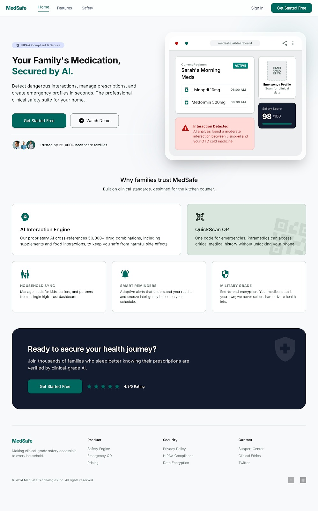
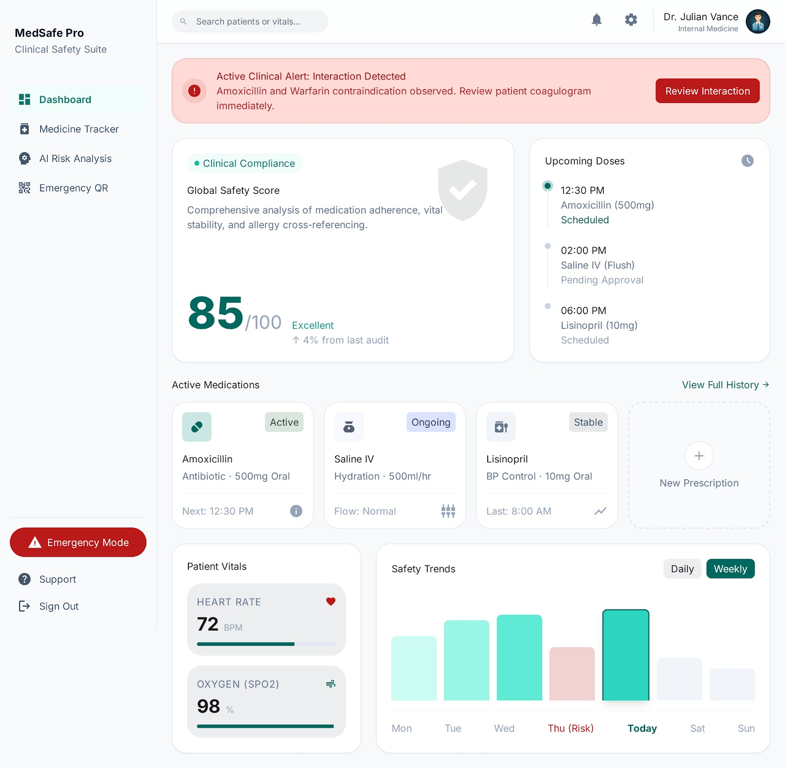

<p align="center">
  
  
  
  
</p>

# 🏥 MedSafe AI — Intelligent Medication Safety System

**MedSafe AI** is a comprehensive, AI-powered medication safety and health management platform designed for patients and healthcare professionals. It provides real-time drug interaction checks, smart medication reminders, emergency health profiles, and clinical risk analysis — all wrapped in a premium "Digital Atelier" UI.

---

## ✨ Features

| Feature | Description |
|---|---|
| 📊 **Smart Dashboard** | Real-time patient safety score, vitals monitoring, and adherence tracking |
| 💊 **Medicine Management** | Add, edit, and track active medications with dosage schedules |
| ⚠️ **Drug Interaction Checker** | AI-powered analysis of potential medication conflicts |
| 🏥 **Emergency Mode** | One-tap SOS with critical health data for first responders |
| 📱 **QR Health Profile** | Scannable QR code linking to patient's public emergency profile |
| 🤖 **AI Chatbot** | Intelligent health assistant for medication queries |
| 📈 **Risk Analysis** | Clinical risk scoring based on medication history and vitals |
| 🔔 **Smart Reminders** | Configurable medication alerts with AM/PM scheduling |
| 📋 **Patient Records** | Comprehensive clinical records and medication history |
| 🏠 **Health Resume** | Complete health overview with vitals and prescriptions |

---

## 📸 Screenshots

<p align="center">
  
  
</p>
<p align="center">
  
  
</p>
<p align="center">
  
  
</p>

---

## 🛠️ Tech Stack

- **Frontend:** React 18, Vite 5, TailwindCSS 3
- **State Management:** Redux Toolkit, React Context API
- **Routing:** React Router DOM v6
- **HTTP Client:** Axios
- **Animations:** Framer Motion
- **Icons:** Lucide React
- **Notifications:** React Hot Toast
- **QR Code:** qrcode.react

---

## 🚀 Getting Started

### Prerequisites

- [Node.js](https://nodejs.org/) v18+ installed
- npm or yarn

### Installation

```bash
# 1. Clone the repository
git clone https://github.com/YOUR_USERNAME/medsafe-ai.git
cd medsafe-ai

# 2. Navigate to the client directory
cd client

# 3. Install dependencies
npm install

# 4. Create your environment file
cp .env.example .env

# 5. Start the development server
npm run dev
```

The app will be running at **http://localhost:3000**

### Build for Production

```bash
cd client
npm run build
```

The optimized bundle will be output to `client/dist/`.

---

## 📁 Project Structure

```
medsafe-ai/
├── client/                     # React frontend application
│   ├── public/                 # Static assets
│   ├── src/
│   │   ├── assets/             # Images and media
│   │   ├── components/         # Reusable UI components
│   │   │   ├── Button.jsx
│   │   │   ├── Input.jsx
│   │   │   ├── Layout.jsx
│   │   │   ├── Sidebar.jsx
│   │   │   ├── LandingNavbar.jsx
│   │   │   ├── LandingFooter.jsx
│   │   │   ├── Modal.jsx
│   │   │   ├── Loader.jsx
│   │   │   ├── PrivateRoute.jsx
│   │   │   ├── ScrollToTop.jsx
│   │   │   └── MobileBottomNav.jsx
│   │   ├── context/            # React Context providers
│   │   │   ├── AuthContext.jsx
│   │   │   └── MobileMenuContext.jsx
│   │   ├── design/             # Design tokens & theme
│   │   │   ├── colors.js
│   │   │   ├── typography.js
│   │   │   ├── spacing.js
│   │   │   └── theme.js
│   │   ├── features/           # Redux feature slices
│   │   │   ├── auth/
│   │   │   ├── chatbot/
│   │   │   ├── medicine/
│   │   │   ├── qr/
│   │   │   └── risk/
│   │   ├── hooks/              # Custom React hooks
│   │   │   └── useAuth.js
│   │   ├── pages/              # Page-level components
│   │   │   ├── Dashboard.jsx
│   │   │   ├── Landing.jsx
│   │   │   ├── Login.jsx
│   │   │   ├── AddMedicine.jsx
│   │   │   ├── MedicineManagement.jsx
│   │   │   ├── MedicationHistory.jsx
│   │   │   ├── HealthResume.jsx
│   │   │   ├── EmergencyMode.jsx
│   │   │   ├── Chatbot.jsx
│   │   │   ├── RiskScore.jsx
│   │   │   ├── Reminders.jsx
│   │   │   ├── PatientRecords.jsx
│   │   │   ├── QRPage.jsx
│   │   │   ├── Settings.jsx
│   │   │   ├── Notifications.jsx
│   │   │   ├── Features.jsx
│   │   │   ├── Safety.jsx
│   │   │   ├── HowItWorks.jsx
│   │   │   └── PublicProfile.jsx
│   │   ├── services/           # API service layer
│   │   │   └── api.js
│   │   ├── utils/              # Utility functions
│   │   │   ├── constants.js
│   │   │   ├── formatDate.js
│   │   │   └── validators.js
│   │   ├── App.jsx             # Root component with routing
│   │   ├── main.jsx            # Application entry point
│   │   └── index.css           # Global styles
│   ├── index.html              # HTML entry point
│   ├── vite.config.js          # Vite configuration
│   ├── tailwind.config.js      # Tailwind configuration
│   ├── postcss.config.js       # PostCSS configuration
│   ├── .eslintrc.cjs           # ESLint configuration
│   ├── .env.example            # Environment template
│   └── package.json            # Dependencies & scripts
├── design/                     # UI design screenshots
├── .gitignore
├── LICENSE
└── README.md
```

---

## ⚙️ Environment Variables

| Variable | Description | Default |
|---|---|---|
| `VITE_API_URL` | Backend API base URL | `http://localhost:5000/api` |

> **Note:** The frontend includes mock data fallbacks when the backend is unavailable, so the app runs in demo mode without a server.

---

## 🤝 Contributing

1. Fork the repository
2. Create your feature branch (`git checkout -b feature/amazing-feature`)
3. Commit your changes (`git commit -m 'Add amazing feature'`)
4. Push to the branch (`git push origin feature/amazing-feature`)
5. Open a Pull Request

---

## 📄 License

This project is licensed under the MIT License — see the [LICENSE](LICENSE) file for details.

---

## 👨‍💻 Author

**Deepak Agrawal**

---

<p align="center">
  Made with ❤️ for better medication safety
</p>
